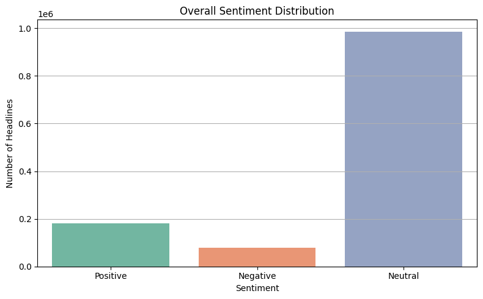
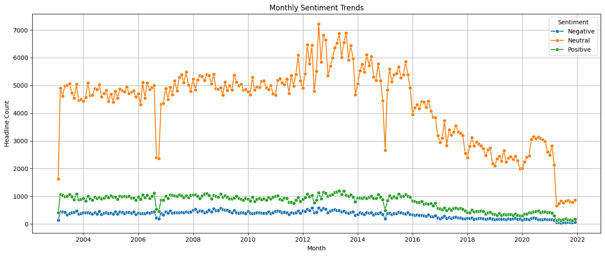

# 🧠 Financial News Sentiment Classification (Multiclass NLP Project)

This project builds and compares multiple machine learning models to classify financial news headlines into three sentiment categories: **Positive**, **Negative**, and **Neutral**. It uses real-world datasets and common NLP techniques to build a pipeline for sentiment modeling.

---

## 🔍 Objective

To develop a robust multiclass sentiment classifier using machine learning and NLP on financial news data, with a focus on model interpretability and class balance.

---

## 📦 Dataset

- **Financial PhraseBank Dataset**
  - Source: [Kaggle](https://www.kaggle.com/datasets/ankurzing/sentiment-analysis-for-financial-news)
  - Contains labeled financial headlines across 3 classes: Positive, Negative, Neutral.

---

## 📊 Techniques Used

- Text Preprocessing: lowercasing, punctuation removal, stopword handling
- Feature Engineering: TF-IDF Vectorization
- Supervised Learning Models:
  - **Logistic Regression** (with class weights)
  - **Multinomial Naive Bayes**
  - **XGBoost Classifier**
- Evaluation Metrics:
  - Accuracy, Precision, Recall, F1-Score, Confusion Matrix

---

## 🧪 Model Performance Summary

| Model               | Accuracy | Macro F1 | Best At                |
|---------------------|----------|----------|-------------------------|
| Logistic Regression | 76%      | 0.72     | Best overall balance ✅ |
| XGBoost Classifier  | 76%      | 0.68     | Strong Neutral recall   |
| Naive Bayes         | 69%      | 0.48     | Overfitted to Neutral   |

Logistic Regression with `class_weight='balanced'` achieved the best balance across all three sentiment classes and is recommended for production use.

---

### Sentiment Distribution

### Monthly Sentiment Trends

---

## 🛠️ Tools Used

- **Languages**: Python
- **Libraries**: scikit-learn, XGBoost, Pandas, Seaborn, Matplotlib
- **ML Techniques**: TF-IDF, Logistic Regression, Naive Bayes, XGBoost
- **Visualization**: Seaborn & Matplotlib

## 📁 Folder Overview

